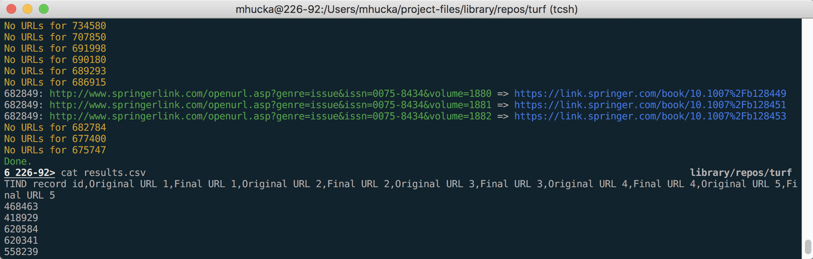

Turf
====

Turf (_TIND.io URL Fixer_) is a program to download records from the Caltech TIND.io database and check the URLs that may be embedded within the records.

*Authors*:      [Michael Hucka](http://github.com/mhucka)<br>
*Repository*:   [https://github.com/caltechlibrary/urlup](https://github.com/caltechlibrary/turf)<br>
*License*:      BSD 3-clause license &ndash; see the [LICENSE](LICENSE) file for more information

[](https://choosealicense.com/licenses/bsd-3-clause)[](http://shields.io)[](http://shields.io)[](https://data.caltech.edu/records/953)

☀ Introduction
-----------------------------

There are several hundred thousand records in [https://caltech.tind.io](https://caltech.tind.io).  Some of the records contain links to other web resources.  As a matter of regular maintenance, the links need to be checked periodically for validity, and preferably also updated to point to new destinations if the referenced resources have been relocated.

Turf is a small program that downloads records from [https://caltech.tind.io](https://caltech.tind.io), examines each one looking for URLs, deferences any found, and then finally prints a list of records together with old and new URLs.  By default, if not given an explicit search string, Turf will do a search for all records that have one or more URLs in MARC field 856.  Alternatively, it can be given a search query on the command line; in that case, the string should be a complete search URL as would be typed into a web browser address bar (or more practically, copied from the browser address bar after performing some exploratory searches in [https://caltech.tind.io](https://caltech.tind.io).  Finally, as another alternative, it can read MARC XML input from a file when given the `-f` option.

✺ Installation instructions
---------------------------

The following is probably the simplest and most direct way to install this software on your computer:
```sh
sudo pip3 install git+https://github.com/caltechlibrary/turf.git
```

Alternatively, you can clone this GitHub repository and then run `setup.py`:
```sh
git clone https://github.com/caltechlibrary/turf.git
cd turf
sudo python3 -m pip install .
```

Both of these installation approaches should automatically install some Python dependencies that Turf relies upon, namely [openpyxl](https://pypi.org/project/openpyxl/), [plac](https://micheles.github.io/plac/), [termcolor](https://pypi.org/project/termcolor/) and [uritools](https://pypi.org/project/uritools/).

▶︎ Basic operation
------------------

Turf is a command-line application.  On Linux and macOS systems, the installation _should_ place a new program on your shell's search path, so that you can start Turf with a simple shell command:
```
turf
```

If that fails because the shell cannot find the command, you should be able to run it using the alternative approach:
```
python3 -m turf
```

It accepts various command-line arguments.  To get information about the available options, use the `-h` argument:
```
turf -h
```

When run without any arguments, Turf will execute a search in [https://caltech.tind.io](https://caltech.tind.io) that looks for records containing URLs in MARC field 856.  It will dereference each URL it finds and print to the terminal each record's identifier, the original URL(s), the final URL(s), and any errors encountered.  Turf can also accept an explicit search query in the form of a complete search URL as would be typed into a web browser address bar (or more practically, copied from the browser address bar after performing some exploratory searches in caltech.tind.io).  The search string should be quoted to prevent the terminal shell from interpreting the punctuation characters in the search string.  Here is an example:
```
turf 'https://caltech.tind.io/search?ln=en&p=856%3A%25&f=&sf=&so=d'
```

Turf won't write the results to a file unless told to do so using the `-o` option.  It can write the results either in `.csv` or `.xlsx` format, and it inspects the file name to figure out which format to write.  For example, the following will make it produce an Excel file as output:
```
turf -o results.xlsx
```

By default, Turf prints a message for every record it processes, so that the user can get a sense of what is happening.  When told to save results to a file, however, it does _not_ write every record by default.  Instead, by default, it saves only the records that contain URLs and for which the URLs are found to dereference to a different final destination.  This behavior can be controlled via two flags, `-u` and `-a`.  If given `-u`, Turf will write out records with URLs even if the URLs dereference to the same location.  If given `-a`, Turf will write all records even if they don't have any URLs.

The difference between `-a` and `-u` is not evident from the default search performed by Turf because it only searches for records with URLs; however, the difference is easier to see when Turf is given a more general search such query such as the following

```
https://caltech.tind.io/search?action_search=Search&rm=wrd&so=d
```

which will retrieve all records.  The following screencast tries to demonstrate this.

[](https://asciinema.org/a/kFvuHPMX51zhc95P1zDeqrmjQ)


Finally, the following table summarizes all the command line options available:

| Short    | Long&nbsp;form&nbsp;option | Meaning | Default |
|----------|---------------|----------------------|---------|
| `-a`     | `--all`       | Save all records, not only those with URLs in MARC field 856 (implies `-u`) | Only write records containing URLs |
| `-f`     | `--file`      | Read MARC XML content from the named file | Search caltech.tind.io | 
| `-o`     | `--output`    | Save output to the named file | Only print results to the terminal |
| `-s`_N_  | `--start-at`_N_  | Start with the <i>N</i><sup>th</sup> record | Start at the first record |
| `-t`_M_  | `--total`_M_     | Stop after processing _M_ records | Process all results found |
| `-u`     | `--unchanged` | Include records whose URLs don't change after dereferencing them | Only save records whose URLs change |
| `-q`     | `--quiet`     | Don't print messages while working | Be chatty while working |
| `-C`     | `--no-color`  | Don't color-code the terminal output | Use colors in the output |
| `-V`     | `--version`   | Only print program version info and exit | Do other work |


⁇ Getting help and support
--------------------------

If you find an issue, please submit it in [the GitHub issue tracker](https://github.com/caltechlibrary/turf/issues) for this repository.  Alternatively, you can [send email](mailto:helpdesk@library.caltech.edu) to the Digital Library Development team at Caltech.

★ Do you like it?
------------------

If you like this software, don't forget to give this repo a star on GitHub to show your support!

☺︎ Acknowledgments
-----------------------

The vector artwork used as a logo for Turf was created by [Milinda Courey](https://thenounproject.com/milindacourey10/) and obtained from [The Noun Project](https://thenounproject.com/term/grass/231760/).  It is licensed under the Creative Commons [CC-BY 3.0](https://creativecommons.org/licenses/by/3.0/) license.

☮︎ Copyright and license
---------------------

Copyright (C) 2018, Caltech.  This software is freely distributed under a BSD 3-clause license.  Please see the [LICENSE](LICENSE) file for more information.
    
<div align="center">
  <a href="https://www.caltech.edu">
    
  </a>
</div>
